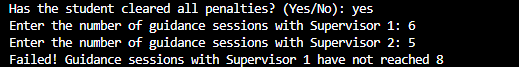
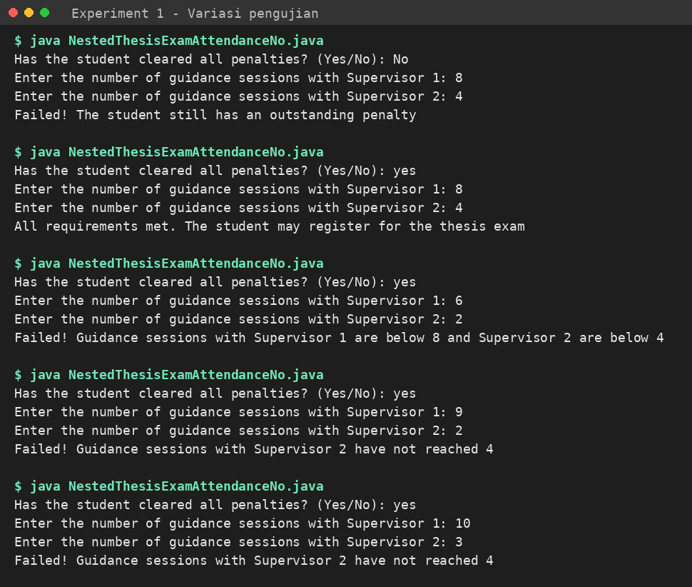
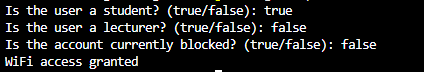
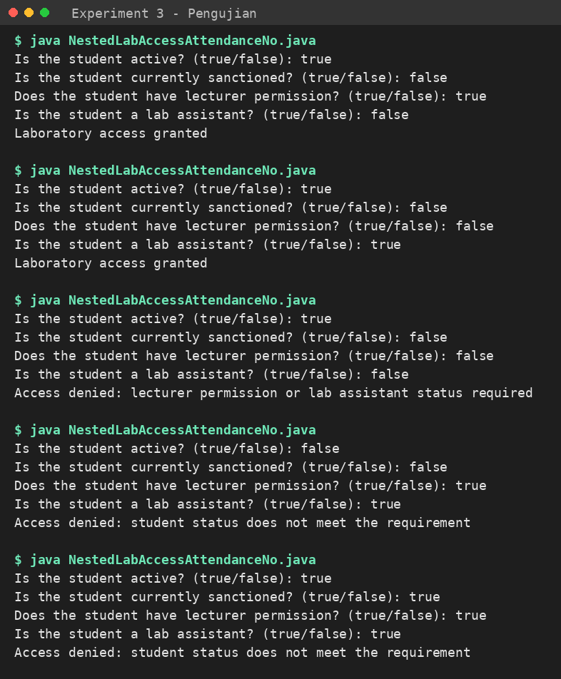
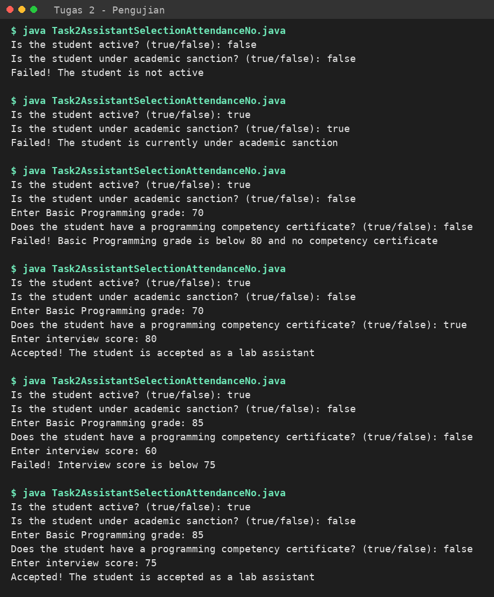

# Jobsheet 6 – Selection Statements 2

**Mata Kuliah:** Dasar Pemrograman (Programming Fundamentals 2026)
**Program Studi:** D4 Teknik Informatika – Politeknik Negeri Malang

> Ganti `AttendanceNo` pada nama file dan nama class dengan nomor absen kamu (contoh: `NestedThesisExam05`). Nama file harus sama persis dengan nama class.

## Struktur Folder

```
jobsheet6/
├── README.md
├── images/
│   ├── exp1-output.png
│   ├── exp1-tests.png
│   ├── exp2-test1.png
│   ├── exp2-test2.png
│   ├── exp2-test3.png
│   ├── exp2-test4.png
│   ├── exp3-tests.png
│   └── task2-tests.png
└── src/
    ├── NestedThesisExamAttendanceNo.java
    ├── LogicalOperatorWifiAttendanceNo.java
    ├── NestedLabAccessAttendanceNo.java
    └── Task2AssistantSelectionAttendanceNo.java
```

## Cara Menjalankan

```bash
cd src
javac NestedThesisExamAttendanceNo.java
java NestedThesisExamAttendanceNo
```

---

## 1. Tujuan

1. Mahasiswa dapat menyelesaikan masalah dan studi kasus menggunakan nested selection.
2. Mahasiswa dapat menerapkan nested selection pada program Java.
3. Mahasiswa dapat menerapkan operator logika `&&`, `||`, dan `!` pada struktur seleksi.

---

## 2.1 Percobaan 1 – Nested IF: Syarat Ujian Skripsi

### Kode

`src/NestedThesisExamAttendanceNo.java`

```java
import java.util.Scanner;

public class NestedThesisExamAttendanceNo {
    public static void main(String[] args) {
        Scanner sc = new Scanner(System.in);
        String message;

        System.out.print("Has the student cleared all penalties? (Yes/No): ");
        String noPenalty = sc.nextLine().trim();

        System.out.print("Enter the number of guidance sessions with Supervisor 1: ");
        int guidanceCount1 = sc.nextInt();
        System.out.print("Enter the number of guidance sessions with Supervisor 2: ");
        int guidanceCount2 = sc.nextInt();

        if (noPenalty.equalsIgnoreCase("Yes")) {
            if (guidanceCount1 >= 8 && guidanceCount2 >= 4) {
                message = "All requirements met. The student may register for the thesis exam";
            } else if (guidanceCount1 < 8 && guidanceCount2 < 4) {
                message = "Failed! Guidance sessions with Supervisor 1 are below 8 and Supervisor 2 are below 4";
            } else if (guidanceCount1 < 8) {
                message = "Failed! Guidance sessions with Supervisor 1 have not reached 8";
            } else {
                message = "Failed! Guidance sessions with Supervisor 2 have not reached 4";
            }
        } else {
            message = "Failed! The student still has an outstanding penalty";
        }
        System.out.println(message);
        sc.close();
    }
}
```

### Output (langkah 8)



### Variasi Pengujian



| Penalti bebas? | Pembimbing 1 | Pembimbing 2 | Hasil |
|---|---|---|---|
| No | 8 | 4 | Gagal – masih ada tanggungan penalti |
| yes | 8 | 4 | Semua syarat terpenuhi |
| yes | 6 | 2 | Gagal – kedua pembimbing kurang |
| yes | 9 | 2 | Gagal – Pembimbing 2 belum 4 |
| yes | 10 | 3 | Gagal – Pembimbing 2 belum 4 |

### Jawaban Pertanyaan

**1. Apa yang terjadi jika mahasiswa menjawab "No"? Mengapa?**
Program langsung menampilkan `Failed! The student still has an outstanding penalty`. Kondisi `noPenalty.equalsIgnoreCase("Yes")` bernilai `false`, sehingga blok `if` luar dilewati dan blok `else` dijalankan. Pengecekan jumlah bimbingan (if di dalam) tidak pernah dievaluasi karena syarat administrasi adalah syarat pertama.

**2. Arti `if (guidanceCount1 >= 8 && guidanceCount2 >= 4) {`**
Kondisi bernilai `true` hanya jika **kedua** syarat terpenuhi sekaligus: bimbingan dengan Pembimbing 1 minimal 8 kali **dan** bimbingan dengan Pembimbing 2 minimal 4 kali. Operator `&&` (AND) menghasilkan `false` jika salah satu syarat tidak terpenuhi.

**3. Alur pengecekan dari awal sampai akhir**
1. Program membaca status penalti dan jumlah bimbingan ke-1 dan ke-2.
2. **Level 1:** apakah penalti sudah bebas (`equalsIgnoreCase("Yes")`)? Jika tidak, tampilkan pesan penalti lalu selesai.
3. **Level 2 (jika bebas penalti):**
   - Pembimbing 1 ≥ 8 **dan** Pembimbing 2 ≥ 4 → semua syarat terpenuhi, boleh daftar ujian skripsi.
   - Jika tidak, Pembimbing 1 < 8 **dan** Pembimbing 2 < 4 → gagal, keduanya kurang.
   - Jika tidak, Pembimbing 1 < 8 → gagal, Pembimbing 1 belum mencapai 8.
   - Selain itu (berarti hanya Pembimbing 2 yang kurang) → gagal, Pembimbing 2 belum mencapai 4.
4. Pesan hasil ditampilkan dengan `System.out.println(message)`.

---

## 2.2 Percobaan 2 – Operator Logika: Akses WiFi Kampus

### Kode

`src/LogicalOperatorWifiAttendanceNo.java`

```java
import java.util.Scanner;

public class LogicalOperatorWifiAttendanceNo {
    public static void main(String[] args) {
        Scanner sc = new Scanner(System.in);
        boolean isStudent;
        boolean isLecturer;
        boolean isBlocked;

        System.out.print("Is the user a student? (true/false): ");
        isStudent = sc.nextBoolean();

        System.out.print("Is the user a lecturer? (true/false): ");
        isLecturer = sc.nextBoolean();

        System.out.print("Is the account currently blocked? (true/false): ");
        isBlocked = sc.nextBoolean();

        if ((isStudent || isLecturer) && !isBlocked) {
            System.out.println("WiFi access granted");
        } else {
            System.out.println("WiFi access denied");
        }
        sc.close();
    }
}
```

### Output Pengujian

**Test 1** (`true, false, false`)



**Test 2** (`false, true, false`)


**Test 3** (`true, false, true`)


**Test 4** (`false, false, false`)


| Test | isStudent | isLecturer | isBlocked | Hasil |
|---|---|---|---|---|
| 1 | true | false | false | granted |
| 2 | false | true | false | granted |
| 3 | true | false | true | denied |
| 4 | false | false | false | denied |

### Jawaban Pertanyaan

**1. Fungsi operator `||`, `&&`, `!`**
- `||` (OR): `true` jika minimal salah satu operand `true`. Di sini: pengguna adalah mahasiswa atau dosen.
- `&&` (AND): `true` hanya jika kedua operand `true`. Di sini: harus (mahasiswa atau dosen) dan akunnya tidak diblokir.
- `!` (NOT): membalik nilai boolean. `!isBlocked` bernilai `true` jika akun tidak diblokir.

**2. Mengapa dosen tetap dapat akses saat `isStudent = false`?**
Karena `isStudent || isLecturer` bernilai `true` selama salah satunya `true`. Dengan `isLecturer = true`, bagian dalam kurung menjadi `true`, dan jika akun tidak diblokir maka `true && true` menghasilkan akses diberikan.

**3. Ubah `||` menjadi `&&`, uji data 1 dan 2**
Kondisi menjadi `(isStudent && isLecturer) && !isBlocked`.
- Test 1 (`true, false, false`): `true && false` = `false` → **denied**.
- Test 2 (`false, true, false`): `false && true` = `false` → **denied**.

Hasilnya berubah dari *granted* menjadi *denied* karena sekarang pengguna harus menjadi mahasiswa **sekaligus** dosen, kondisi yang hampir tidak pernah terjadi.

**4. Kapan `isLecturer` tidak perlu dievaluasi (short-circuit)?**
Pada `isStudent || isLecturer`, jika `isStudent` bernilai `true`, hasil OR pasti `true` apa pun nilai `isLecturer`, sehingga Java melewati evaluasi `isLecturer`.

**5. Kapan `!isBlocked` tidak perlu dievaluasi?**
Pada `(isStudent || isLecturer) && !isBlocked`, jika `(isStudent || isLecturer)` bernilai `false` (bukan mahasiswa dan bukan dosen), hasil AND pasti `false`, sehingga `!isBlocked` tidak dievaluasi.

---

## 2.3 Percobaan 3 – Nested IF dan Operator Logika: Akses Laboratorium

### Kode

`src/NestedLabAccessAttendanceNo.java`

```java
import java.util.Scanner;

public class NestedLabAccessAttendanceNo {
    public static void main(String[] args) {
        Scanner sc = new Scanner(System.in);
        boolean isActiveStudent;
        boolean isSanctioned;
        boolean hasLecturerPermit;
        boolean isLabAssistant;

        System.out.print("Is the student active? (true/false): ");
        isActiveStudent = sc.nextBoolean();
        System.out.print("Is the student currently sanctioned? (true/false): ");
        isSanctioned = sc.nextBoolean();
        System.out.print("Does the student have lecturer permission? (true/false): ");
        hasLecturerPermit = sc.nextBoolean();
        System.out.print("Is the student a lab assistant? (true/false): ");
        isLabAssistant = sc.nextBoolean();

        if (isActiveStudent && !isSanctioned) {
            if (hasLecturerPermit || isLabAssistant) {
                System.out.println("Laboratory access granted");
            } else {
                System.out.println("Access denied: lecturer permission or lab assistant status required");
            }
        } else {
            System.out.println("Access denied: student status does not meet the requirement");
        }
        sc.close();
    }
}
```

### Output Pengujian



Urutan input: `isActiveStudent`, `isSanctioned`, `hasLecturerPermit`, `isLabAssistant`.

| No | Active | Sanctioned | Permit | Assistant | Output |
|---|---|---|---|---|---|
| 1 | true | false | true | false | Laboratory access granted |
| 2 | true | false | false | true | Laboratory access granted |
| 3 | true | false | false | false | Access denied: lecturer permission or lab assistant status required |
| 4 | false | false | true | true | Access denied: student status does not meet the requirement |
| 5 | true | true | true | true | Access denied: student status does not meet the requirement |

### Jawaban Pertanyaan

**1. Mengapa `hasLecturerPermit || isLabAssistant` ada di dalam if pertama?**
Karena pengecekan izin dosen/asisten lab hanya relevan jika mahasiswa sudah lolos syarat dasar (aktif dan tidak terkena sanksi). Mahasiswa yang gagal syarat dasar tidak perlu dicek lebih lanjut.

**2. Fungsi `&&`, `||`, `!`**
- `&&`: `isActiveStudent && !isSanctioned` – harus aktif **dan** tidak sedang disanksi.
- `!`: `!isSanctioned` – bernilai `true` jika mahasiswa tidak sedang disanksi.
- `||`: `hasLecturerPermit || isLabAssistant` – cukup salah satu: punya izin dosen atau menjadi asisten lab.

**3. Bisakah ditulis satu kondisi `isActiveStudent && !isSanctioned && (hasLecturerPermit || isLabAssistant)`?**
Ya, keputusan akhir (granted atau denied) **tetap sama** karena logikanya setara. Bedanya, dengan satu kondisi program tidak bisa membedakan alasan penolakan.

**4. Keuntungan Nested IF dibanding satu IF?**
Nested IF dapat menampilkan alasan penolakan yang berbeda di tiap level (status mahasiswa tidak memenuhi syarat vs. belum punya izin dosen/asisten lab). Satu IF hanya menghasilkan dua kemungkinan: granted atau denied tanpa alasan spesifik.

**5. Contoh input ditolak di level 1 dan level 2**
- Level 1 ditolak: `isActiveStudent = false`, `isSanctioned = false`, `hasLecturerPermit = true`, `isLabAssistant = true`.
- Level 2 ditolak: `isActiveStudent = true`, `isSanctioned = false`, `hasLecturerPermit = false`, `isLabAssistant = false`.

---

## 3. Tugas

### Tugas 1 – Sistem Diskon Toko Buku

> Belum dikerjakan: membutuhkan flowchart Latihan 2 Minggu 6 yang tidak ada di jobsheet ini. Tambahkan file `src/Task1BookstoreDiscountAttendanceNo.java` setelah flowchart tersedia.

### Tugas 2 – Seleksi Calon Asisten Lab

`src/Task2AssistantSelectionAttendanceNo.java`

```java
import java.util.Scanner;

public class Task2AssistantSelectionAttendanceNo {
    public static void main(String[] args) {
        Scanner sc = new Scanner(System.in);

        System.out.print("Is the student active? (true/false): ");
        boolean isActiveStudent = sc.nextBoolean();
        System.out.print("Is the student under academic sanction? (true/false): ");
        boolean isSanctioned = sc.nextBoolean();

        if (isActiveStudent && !isSanctioned) {
            // Tahap 1 lolos: cek syarat pemrograman
            System.out.print("Enter Basic Programming grade: ");
            int grade = sc.nextInt();
            System.out.print("Does the student have a programming competency certificate? (true/false): ");
            boolean hasCertificate = sc.nextBoolean();

            if (grade >= 80 || hasCertificate) {
                // Tahap 2 lolos: wawancara
                System.out.print("Enter interview score: ");
                int interviewScore = sc.nextInt();

                if (interviewScore >= 75) {
                    System.out.println("Accepted! The student is accepted as a lab assistant");
                } else {
                    System.out.println("Failed! Interview score is below 75");
                }
            } else {
                System.out.println("Failed! Basic Programming grade is below 80 and no competency certificate");
            }
        } else if (!isActiveStudent) {
            System.out.println("Failed! The student is not active");
        } else {
            System.out.println("Failed! The student is currently under academic sanction");
        }
        sc.close();
    }
}
```

### Output Pengujian



| Skenario | Hasil |
|---|---|
| Tidak aktif | Failed – tidak aktif |
| Aktif, terkena sanksi | Failed – sanksi akademik |
| Nilai 70, tanpa sertifikat | Failed – nilai < 80 dan tanpa sertifikat |
| Nilai 70, punya sertifikat, wawancara 80 | Accepted |
| Nilai 85, wawancara 60 | Failed – wawancara < 75 |
| Nilai 85, wawancara 75 | Accepted |
